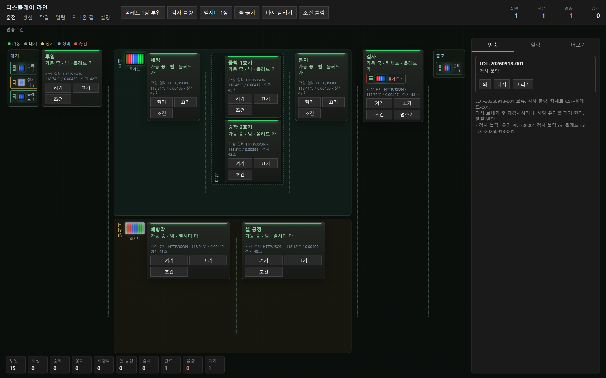
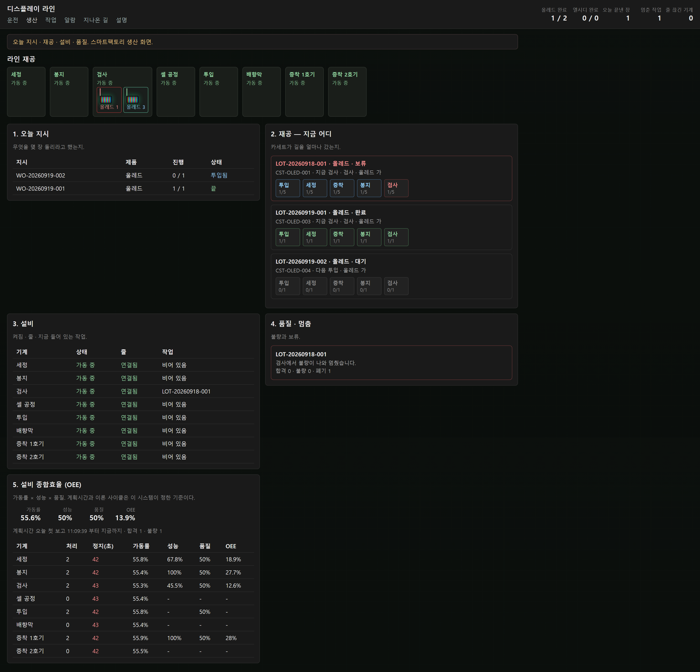
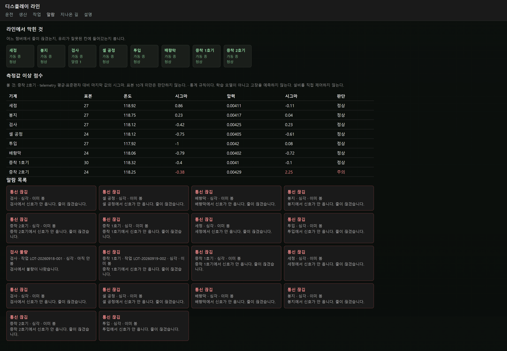
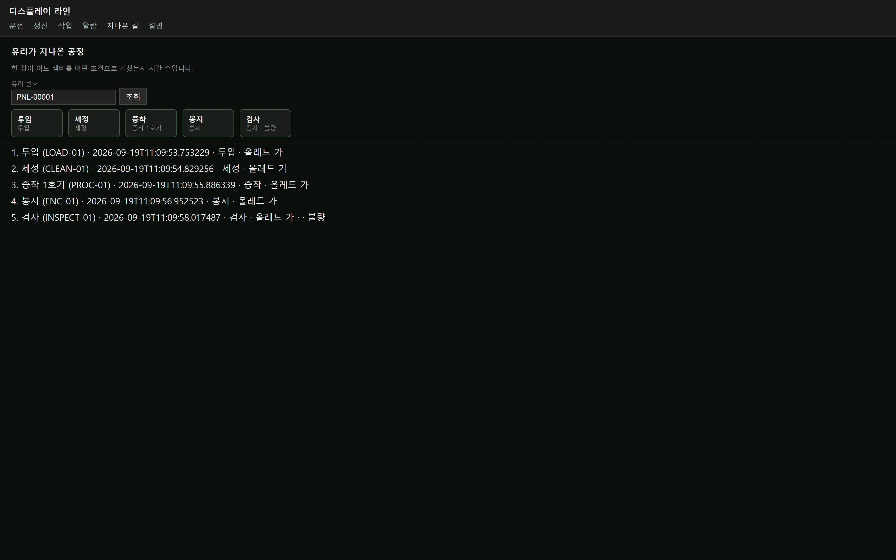

# DisplayFab — 디스플레이 라인 스마트팩토리 (학습 프로젝트)

가상의 OLED / LCD 디스플레이 생산 라인을 만들고, **설비 데이터가 시스템에 들어와
상태·알람·실적이 되는 전 과정**을 직접 구현했다.

설비 8대가 HTTP로 실적과 생존신호를 올린다. 서버가 그것을 검증하고 저장하고,
문제가 생기면 라인을 멈춘다. 관제 화면에서 사람이 설비를 켜고 조건을 걸고 불량을 처리한다.

**설비는 가상이다. 실제 PLC 케이블은 없다.** 그래서 PLC·OPC UA·Modbus 통신을
있는 것처럼 구현하지 않았다. 자리만 열어 두고 미구현이라고 적어 뒀다.

**시연 모드:** 서버가 설비 클라이언트 역할을 대신한다. 버튼을 직접 눌러볼 수 있고,
1시간마다 데이터가 처음 상태로 돌아간다. Docker·PostgreSQL 실행과 검증을 마쳤으며,
인터넷 공개 주소는 아직 발급 전이다. [배포·실행 안내](docs/DEPLOYMENT.md)



> 운전 화면. 왼쪽부터 투입 → (초록) 올레드 라인: 세정·증착 1·2호기·봉지 →
> (노랑) 엘시디 라인: 배향막·셀 공정 → 검사 → 출고.
> 각 설비 카드에 통신 방식, 마지막 측정값, 오늘 정지시간이 함께 나온다.
> 오른쪽은 검사 불량으로 멈춘 작업이고, 아래는 공정별 재공 수다.

---

## 왜 만들었나

제조 IT·생산 시스템 직무를 준비하면서, 이 일이 화면을 만드는 일이 아니라
**설비에서 올라온 데이터가 상태가 되고 장애를 추적하는 일**이라고 이해했다.

실제 설비가 없으니 라인을 만들 수는 없었다. 그래서 설비·작업·조건·알람·이력을
축소해서, 장애가 났을 때 시뮬레이터부터 DB까지 어디를 봐야 하는지 직접 겪어 보는
연습 시스템을 만들었다.

핵심은 기능 개수가 아니라 **판단**이다. 어디까지 만들고 어디부터 만들지 않았는지,
왜 그렇게 정했는지를 문서와 코드에 남겼다.

---

## 5분 안에 직접 돌려보기

필요한 것: Docker, Python 3.11+

```bash
# 1. DB 띄우기 (PostgreSQL)
docker compose up -d

# 2. 서버 띄우기
cd backend
python -m pip install -r requirements.txt
python -m uvicorn app.main:app --reload --port 8000
```

브라우저에서 <http://127.0.0.1:8000> 을 열면 위 스크린샷 화면이 나온다.
설비 8대와 공정 조건 3개, 작업 3건이 미리 들어가 있다.

**화면에서 이 순서로 눌러 보면 라인이 한 바퀴 돈다.**

| 순서 | 누르는 것 | 일어나는 일 |
|---|---|---|
| 1 | 상단 `올레드 1장 투입` | 유리 한 장이 투입 → 세정 → 증착 → 봉지 → 검사를 지나간다 |
| 2 | 설비 카드의 `끄기` / `켜기` / `조건` | 호스트가 설비를 세우고 켜고 공정 조건을 건다 |
| 3 | 상단 `줄 끊기` | 그 설비가 끊김이 되고, 이후 올라오는 실적은 거절된다 |
| 4 | 상단 `다시 살리기` | 생존신호가 돌아오면 끊김이 풀리고 흐름이 이어진다 |
| 5 | 상단 `검사 불량` | 작업이 보류되고 왜 멈췄는지 뜬다. `왜` · `다시` · `버리기`로 처리한다 |
| 6 | 상단 `생산` 탭 | 오늘 지시·재공·완료·불량·OEE가 운전 화면과 맞는지 본다 |

`엘시디 1장`은 다른 공정 경로(배향막 → 셀 공정)를 타고, `조건 틀림`은 설비에 걸린 조건과
다른 조건으로 보고해서 거절되는 걸 보여 준다.

화면을 누르는 대신 API로 같은 6단을 한 번에 확인할 수도 있다. 41개 항목을 검사한다.

```bash
cd backend
python scripts/demo_check.py --base http://127.0.0.1:8000
```

설비 쪽을 직접 돌려 보려면 (설비 역할을 하는 클라이언트가 Python·C# 두 개 있다):

```bash
python simulator/python_simulator.py --loop        # 생존신호 계속 보내기
python simulator/python_simulator.py --run-order   # 작업지시 한 건 실행

cd csharp_simulator
dotnet run -- --heartbeat --loop
dotnet run -- --run-line
```

시연 전에 초기화하려면 (DB는 컨테이너 볼륨에 있다):

```bash
docker compose down -v && docker compose up -d
```

---

## 공개 시연 서버

로컬은 사람이 시뮬레이터를 켠다. 공개 주소에는 그 시뮬레이터가 없으니, 서버가
설비 클라이언트 역할을 대신한다. 수집·검증·알람 경로는 로컬과 같다.

구성:

- 웹: Render, Docker 이미지 하나 (API + 화면)
- DB: Neon PostgreSQL (접속 문자열만 환경변수)
- 자동 운전: 6초마다 생존신호, 30초마다 유리 한 장, 1시간마다 초기화
- 쓰기 분당 60건 제한. 누구나 버튼을 눌러볼 수 있게 열어 두되 낙서는 막는다

배포 파일은 저장소 루트의 `Dockerfile` 과 `render.yaml` 이다.

로컬 Docker 시연 서버와 공개 배포·검증 절차는 [배포 운영 문서](docs/DEPLOYMENT.md)에 정리했다.

[이 저장소를 Render에 배포](https://render.com/deploy?repo=https://github.com/ssg-sak/displayfab-smart-factory)

```bash
# 1) Neon에서 PostgreSQL을 만들고 접속 문자열을 받는다
#    postgresql://사용자:비밀번호@호스트/DB?sslmode=require
# 2) Render Dashboard → New → Blueprint
#    이 저장소를 연결하면 render.yaml 대로 웹 서비스가 생긴다
# 3) DISPLAYFAB_DATABASE_URL 에 Neon 문자열을 넣는다 (postgresql:// 그대로 넣어도 된다)
```

무료 웹 서비스는 15분 동안 요청이 없으면 잠든다. 처음 열 때 수십 초가 걸릴 수 있다.
잠든 동안에도 DB는 남아 있고, 깨어나면 자동 운전이 다시 생존신호를 올린다.

---

## 화면 4개

### 생산 — 오늘 실적과 설비 종합효율(OEE)



오늘 지시가 얼마나 진행됐고, 카세트가 어느 공정까지 갔고, 설비가 어떤 상태인지 본다.
맨 아래가 OEE다. 위 스크린샷의 가동률이 낮은 건 방금 시연에서 설비를 여러 번 세웠기
때문이고, 계산에 쓴 정지시간이 실제로 기록된 값이라 그렇게 나온다.
**낼 수 없는 숫자는 `-` 로 두고 왜 못 내는지 화면에 적는다.**

### 알람 — 막힌 것과 측정값 이상 점수



어느 설비에서 줄이 끊겼는지, 유리가 잘못된 공정에 들어갔는지 본다.
위쪽 표는 측정값 이상 점수다. 오늘 쌓인 측정값의 평균·표준편차 대비 마지막 값이
몇 시그마인지만 낸다. 스크린샷에서는 증착 2호기의 압력이 2σ를 넘어 `주의`로 잡혔다.
**학습 모델이 아니다.** 표본이 10개 미만이면 "데이터 부족"이라고 답한다.

### 지나온 길 — 유리 한 장의 이력



유리 번호를 넣으면 그 한 장이 어느 설비를 어떤 조건으로 언제 지났는지 순서대로 나온다.
위 화면의 유리는 검사에서 불량이 나서 마지막 줄이 불량으로 끝났다.

### 작업 — 카세트와 유리 슬롯

카세트 안 유리 한 칸씩의 상태(진행·합격·불량·폐기)를 본다.

---

## 어떻게 생겼나

```text
┌─ 현장 (가상) ────────────────────────────────────────────┐
│  Python 시뮬레이터        C# 클라이언트 (.NET 8)          │
│  온도·압력 생성, 상태 보고, 장애 주입                      │
└───────────────────────┬──────────────────────────────────┘
                        │  HTTP / JSON  (+ X-Request-Id)
                        ▼
┌─ 호스트 (FastAPI) ───────────────────────────────────────┐
│  수집    POST /api/events → 수집기 → 측정값 저장           │
│  검증    없는 설비·작업·유리 / 조건 불일치 / 공정 순서 위반  │
│          중복 보고 / 오래된 시각 / 끊긴 설비 / 범위 이탈     │
│  판단    알람 생성, 작업 보류(HOLD), 설비 상태 전이         │
│  MES     작업지시 → 투입 → 라인 실행 → 재공 → 오늘 실적     │
│  분석    OEE, 측정값 이상 점수 (읽기 전용)                 │
│  제어    POST /api/commands → 어댑터 → 설비 상태           │
└───────────────────────┬──────────────────────────────────┘
                        ▼
┌─ 데이터 (PostgreSQL) ────────────────────────────────────┐
│  설비 · 작업 · 유리 · 공정조건 · 공정이력 · 측정값          │
│  정지구간 · 알람 · 이벤트로그 · 명령                       │
└───────────────────────┬──────────────────────────────────┘
                        ▼
              관제 화면 5개 (운전·생산·작업·알람·이력)
```

### 이벤트 한 건이 지나가는 길

```text
설비가 실적 한 건을 올린다
        ↓  POST /api/events
api/events.py            요청 ID를 붙인다
        ↓
services/collector.py    측정값(telemetry)을 먼저 남긴다
        ↓
event_ingestion.py       검증 → 저장 → 상태 갱신 → 알람 → 작업 진행 반영
        ↓
PostgreSQL
        ↓
GET /api/equipment  /production  /analytics/oee  /alarms …
        ↓
관제 화면
```

한 건이 어디서 어떻게 됐는지는 로그의 `request_id` / `event_id`로 끝까지 따라간다.
막히면 화면부터 고치지 않는다. 설비 → HTTP → 검증 → DB → API → 화면 순으로 찾는다.

---

## 일부러 이렇게 한 것

이 프로젝트에서 제일 설명하고 싶은 부분이다.

**설비 상태와 연결 상태를 분리했다.**
설비가 가동(RUN)인 것과 통신이 연결(ONLINE)된 것은 다른 사실이다.
"가동인데 끊김"은 마지막 보고는 가동이었고 지금은 데이터가 안 들어온다는 뜻이다.

**검증 거절과 전송 실패를 구분했다.**
잘못된 데이터가 와서 거절된 것도 통신은 살아 있는 것이다. 그래서 거절된 이벤트도
마지막 보고 시각을 갱신한다. 그러지 않으면 데이터가 계속 오는데도 끊김으로 오판한다.

**통신 방식을 설비 속성으로 두고 어댑터로 갈랐다.**
지금 실체가 있는 건 HTTP/JSON 시뮬레이터 어댑터 하나다. OPC UA·Modbus 어댑터는
호출하면 미구현 예외가 난다. 장비가 없는데 세션을 흉내 내면, 실제 장비를 붙일 때
그 가짜 코드를 먼저 지워야 한다. 수집 이후 경로는 통신 방식과 무관하게 같으므로
장비가 생기면 어댑터 하나만 채우면 된다.

**모르는 값은 모른다고 답한다.**
OEE의 계획가동시간은 현장 교대표가 없어서 "오늘 첫 설비 보고부터 지금까지"를 쓰고,
어느 기준을 썼는지 API 응답에 같이 담는다. 가짜 가동시간으로 숫자를 채우지 않았다.
실적이 없으면 성능은 `null`이고, 이유가 응답에 문장으로 들어간다.

**분석은 설비를 직접 제어하지 않는다.**
OEE와 이상 점수는 숫자만 낸다. 알람을 낼지, 설비를 세울지는 사람이나 MES가 정한다.
제어 경로는 하나다: `사람 → POST /api/commands → 어댑터 → 설비`.

**생존신호는 설비가 보낸다. 호스트가 DB를 직접 고쳐서 살리지 않는다.**
라인 실행이 10초를 넘기면 그 사이 조용한 설비가 끊김으로 빠지는 문제가 있었다.
호스트가 마지막 보고 시각만 고치면 쉽게 해결되지만, 그러면 "줄 끊기" 시연이
더 이상 진짜로 깨지지 않는다. 그래서 시뮬레이터가 실행 중에도 5초마다
라인 전체의 생존신호를 보내도록 고쳤다.

공개 시연 서버에는 그 시뮬레이터가 없다. 그래서 그 서버에서만
`DISPLAYFAB_DEMO_AUTOPILOT=1` 로 서버가 설비 클라이언트 역할을 대신한다.
측정값을 DB에 직접 쓰지 않고, 화면의 `돌리기`와 같은 수집 경로를 탄다.
로컬 기본값은 꺼져 있다.

---

## 일부러 안 한 것

| 안 한 것 | 이유 |
|---|---|
| 실제 PLC / OPC UA / Modbus 통신 | 장비가 없다. 흉내 내지 않고 자리만 열어 뒀다 |
| AI 이상탐지 · 고장 예측 | 학습 데이터가 없다. 통계 규칙(시그마)까지만 했다 |
| Kafka · 메시지 버스 | 단일 FastAPI로 충분한 규모다 |
| Kubernetes | DB만 Docker로 띄운다 |
| 프론트엔드 프레임워크 | 관제 화면은 Vanilla JS로 충분했다 |

그 밖의 한계도 숨기지 않는다.

- 공정 조건 수치는 이 시스템용이고 현장 스펙이 아니다
- 실제 MES / CIM 전체가 아니라 그 앞단의 수집·검증·모니터링 축소판이다
- 작업 완료는 그 작업의 유리가 모두 검사를 통과했을 때다
- `csharp_lessons/` 는 라인과 무관한 C# 언어 연습 폴더다

---

## 테스트

```bash
cd backend
python -m pytest -q        # 98건. Docker 없이 인메모리 SQLite로 돈다
```

이벤트 한 건이 상태와 알람까지 제대로 바꾸는지, 잘못된 이벤트가 제대로 거절되는지를
검사한다. 통신 끊김, 조건 불일치, 공정 순서 위반, 검사 불량 보류, OEE 계산,
이상 점수까지 모두 테스트가 있다.

실제 서버에 대고 시연 전체를 확인하는 스크립트도 있다.

```bash
python scripts/demo_check.py --base http://127.0.0.1:8000   # 41개 항목
```

이 문서의 스크린샷도 스크립트로 다시 찍는다. 화면을 고치면 문서 이미지가 같이 갱신된다.
서버 실행에는 필요 없는 도구라서 `requirements-dev.txt`로 분리했다.

```bash
python -m pip install -r requirements-dev.txt
python -m playwright install chromium
python scripts/shoot_screens.py --base http://127.0.0.1:8000
```

---

## 폴더

```text
backend/            FastAPI 호스트
  app/api/          라우터 (events, commands, equipment, mes, analytics …)
  app/services/     수집·검증·알람·MES·OEE·이상점수
  app/adapters/     설비 통신 어댑터 (시뮬레이터 실체 / OPC UA·Modbus 미구현)
  app/domain/       공정 경로와 인터록 규칙
  tests/            pytest 98건
  scripts/          시연 검증, 화면 촬영
simulator/          Python 설비 시뮬레이터
csharp_simulator/   C# 설비 클라이언트 (.NET 8)
dashboard/          관제 화면 5개
analytics/          OEE · 이상탐지 설계 문서
sql/                면접용 SQL 연습 쿼리
csharp_lessons/     C# 언어 연습 (라인과 무관)
```

## 문서

| 문서 | 내용 |
|---|---|
| [ARCHITECTURE.md](ARCHITECTURE.md) | 설계, DB 스키마, API 목록 |
| [ARCHITECTURE_LAYERS.md](ARCHITECTURE_LAYERS.md) | 스마트팩토리 계층별 구현 상태와 남은 일 |
| [TROUBLESHOOTING.md](TROUBLESHOOTING.md) | 장애 사례별 추적 순서 |
| [INTERVIEW_NOTES.md](INTERVIEW_NOTES.md) | 이 프로젝트로 답하는 기술 질문 18개 |
| [SQL_PRACTICE.md](SQL_PRACTICE.md) | 같은 질문을 ORM과 SQL로 각각 풀기 |
| [analytics/oee/README.md](analytics/oee/README.md) | OEE 계산 근거와 기준값 출처 |
| [analytics/anomaly/README.md](analytics/anomaly/README.md) | 이상 점수 규칙과 하지 않은 것 |
| [IMPLEMENTATION_PLAN.md](IMPLEMENTATION_PLAN.md) | 만들면서 정한 순서와 판단 (작업 기록) |
| [CSHARP_BEGINNER.md](CSHARP_BEGINNER.md) | C# 클라이언트를 처음 쓰며 정리한 메모 |
| [ROADMAP.md](ROADMAP.md) | 작업 당시의 일정 계획 (기록용) |
